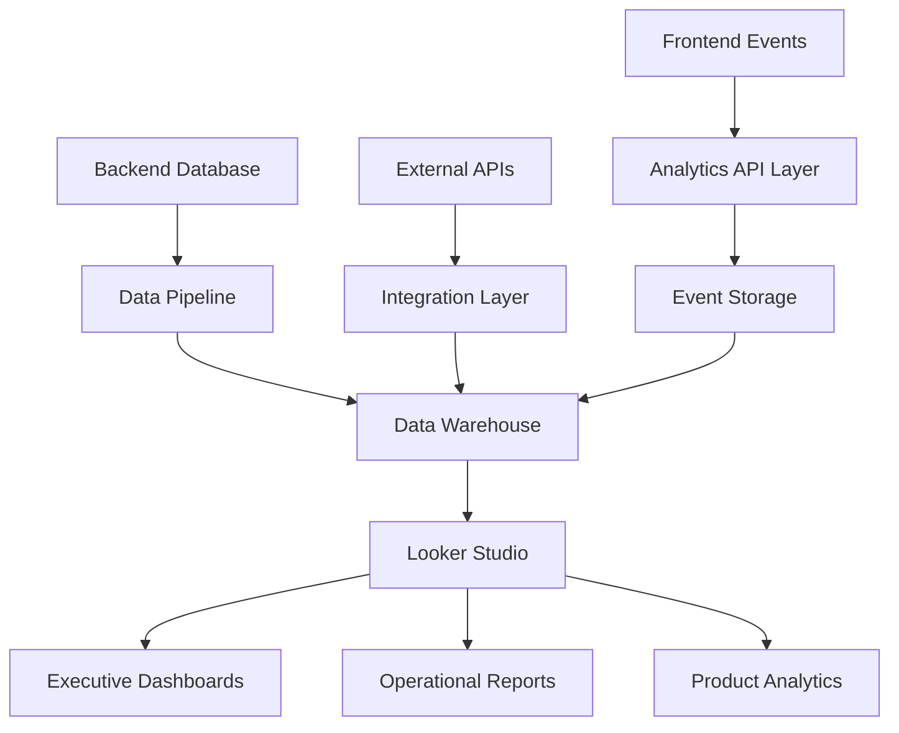

# 🎯 Bidaaya Platform - Looker Data Architecture & Analytics Plan

## 📊 **Core Analytics Objectives**

### **Business Intelligence Goals**
- **Revenue Analytics**: Track subscription conversions, churn, and LTV
- **User Engagement**: Monitor platform usage patterns and feature adoption
- **Matching Efficiency**: Measure AI recruitment success rates
- **Operational Metrics**: Platform performance and user satisfaction

### **Key Stakeholder Dashboards**
1. **Executive Dashboard**: High-level KPIs and business metrics
2. **Operations Dashboard**: User onboarding, support, and platform health
3. **Product Dashboard**: Feature usage, A/B testing, and user journeys
4. **Sales Dashboard**: Lead generation, conversion funnels, and revenue

---

## 🗄️ **Data Architecture Overview**

### **Data Collection Strategy**


### **Data Sources**
1. **Primary Database (PostgreSQL/Prisma)**
2. **Event Tracking (Custom Analytics API)**
3. **External Integrations** (Stripe, Calendly, Email Services)
4. **AI/ML Pipeline Data**
5. **Support & Communication Systems**

---

## 📋 **Database Schema Enhancements for Analytics**

### **New Analytics Tables**

#### **1. User Events Table**
```sql
CREATE TABLE user_events (
  id UUID PRIMARY KEY DEFAULT gen_random_uuid(),
  user_id VARCHAR REFERENCES users(id),
  event_type VARCHAR NOT NULL, -- 'page_view', 'click', 'form_submit', etc.
  event_category VARCHAR NOT NULL, -- 'navigation', 'application', 'payment', etc.
  event_data JSONB, -- Flexible event properties
  session_id VARCHAR,
  ip_address INET,
  user_agent TEXT,
  referrer TEXT,
  created_at TIMESTAMP DEFAULT NOW(),
  
  -- Indexes for analytics queries
  INDEX idx_events_user_time (user_id, created_at),
  INDEX idx_events_type_time (event_type, created_at),
  INDEX idx_events_session (session_id)
);
```

#### **2. Application Analytics Table**
```sql
CREATE TABLE application_analytics (
  id UUID PRIMARY KEY DEFAULT gen_random_uuid(),
  application_id VARCHAR REFERENCES applications(id),
  user_id VARCHAR REFERENCES users(id),
  project_id VARCHAR REFERENCES projects(id),
  company_id VARCHAR,
  
  -- Timing Data
  application_submitted_at TIMESTAMP,
  first_viewed_at TIMESTAMP,
  company_first_viewed_at TIMESTAMP,
  interview_scheduled_at TIMESTAMP,
  decision_made_at TIMESTAMP,
  
  -- Engagement Metrics
  time_to_apply INTEGER, -- seconds from first view to apply
  company_response_time INTEGER, -- seconds from apply to first company action
  total_application_views INTEGER DEFAULT 0,
  company_profile_views INTEGER DEFAULT 0,
  
  -- AI Ranking Data
  ai_ranking_score DECIMAL(5,2),
  ai_ranking_position INTEGER,
  ai_match_reasons JSONB,
  
  created_at TIMESTAMP DEFAULT NOW(),
  updated_at TIMESTAMP DEFAULT NOW()
);
```

#### **3. Subscription Analytics Table**
```sql
CREATE TABLE subscription_analytics (
  id UUID PRIMARY KEY DEFAULT gen_random_uuid(),
  user_id VARCHAR REFERENCES users(id),
  
  -- Subscription Journey
  first_visit_at TIMESTAMP,
  trial_started_at TIMESTAMP,
  upgrade_prompt_shown_at TIMESTAMP,
  payment_initiated_at TIMESTAMP,
  subscription_completed_at TIMESTAMP,
  
  -- Conversion Data
  pages_visited_before_upgrade INTEGER,
  features_used_before_upgrade JSONB,
  upgrade_trigger_feature VARCHAR, -- Which feature prompted upgrade
  
  -- Pricing Data
  tier_selected VARCHAR,
  monthly_vs_annual VARCHAR,
  discount_applied DECIMAL(5,2),
  
  -- Churn Data
  downgrade_initiated_at TIMESTAMP,
  cancellation_requested_at TIMESTAMP,
  churn_reason VARCHAR,
  exit_survey_data JSONB,
  
  created_at TIMESTAMP DEFAULT NOW()
);
```

#### **4. Feature Usage Analytics Table**
```sql
CREATE TABLE feature_usage_analytics (
  id UUID PRIMARY KEY DEFAULT gen_random_uuid(),
  user_id VARCHAR REFERENCES users(id),
  feature_name VARCHAR NOT NULL,
  
  -- Usage Metrics
  first_used_at TIMESTAMP,
  last_used_at TIMESTAMP,
  total_usage_count INTEGER DEFAULT 1,
  session_duration INTEGER, -- seconds spent in feature
  
  -- Context Data
  user_tier VARCHAR,
  device_type VARCHAR,
  feature_version VARCHAR,
  
  -- Success Metrics
  feature_completed BOOLEAN DEFAULT FALSE,
  completion_time INTEGER, -- seconds to complete feature
  error_encountered BOOLEAN DEFAULT FALSE,
  error_details JSONB,
  
  created_at TIMESTAMP DEFAULT NOW(),
  
  -- Unique constraint to prevent duplicates
  UNIQUE(user_id, feature_name, DATE(created_at))
);
```

#### **5. AI Performance Analytics Table**
```sql
CREATE TABLE ai_performance_analytics (
  id UUID PRIMARY KEY DEFAULT gen_random_uuid(),
  
  -- Context
  operation_type VARCHAR NOT NULL, -- 'candidate_ranking', 'transcript_analysis', 'matching'
  project_id VARCHAR REFERENCES projects(id),
  company_id VARCHAR,
  
  -- AI Metrics
  algorithm_version VARCHAR,
  processing_time_ms INTEGER,
  confidence_score DECIMAL(5,2),
  
  -- Input Data
  input_data_size INTEGER,
  input_quality_score DECIMAL(5,2),
  
  -- Output Validation
  prediction_accuracy DECIMAL(5,2), -- When ground truth is available
  company_satisfaction_score INTEGER, -- 1-5 rating
  student_success_rate DECIMAL(5,2),
  
  -- Performance Metrics
  false_positive_rate DECIMAL(5,2),
  false_negative_rate DECIMAL(5,2),
  
  created_at TIMESTAMP DEFAULT NOW()
);
```

---

## 📈 **Event Tracking Implementation**

### **Frontend Analytics SDK**

#### **Event Types to Track**
```typescript
interface AnalyticsEvent {
  userId?: string
  sessionId: string
  eventType: string
  eventCategory: string
  eventData?: Record<string, any>
  timestamp: Date
}

// Core Events
const EVENTS = {
  // Navigation
  PAGE_VIEW: 'page_view',
  NAVIGATION_CLICK: 'navigation_click',
  
  // Applications
  PROJECT_VIEWED: 'project_viewed',
  APPLICATION_STARTED: 'application_started',
  APPLICATION_SUBMITTED: 'application_submitted',
  APPLICATION_STATUS_CHECKED: 'application_status_checked',
  
  // Onboarding
  ONBOARDING_STEP_COMPLETED: 'onboarding_step_completed',
  PROFILE_FIELD_FILLED: 'profile_field_filled',
  CHECKLIST_ITEM_COMPLETED: 'checklist_item_completed',
  
  // Subscription
  PAYWALL_SHOWN: 'paywall_shown',
  UPGRADE_CLICKED: 'upgrade_clicked',
  PAYMENT_INITIATED: 'payment_initiated',
  SUBSCRIPTION_COMPLETED: 'subscription_completed',
  
  // Feature Usage
  FEATURE_ACCESSED: 'feature_accessed',
  FEATURE_COMPLETED: 'feature_completed',
  FEATURE_ERROR: 'feature_error',
  
  // AI Interactions
  AI_RECOMMENDATION_SHOWN: 'ai_recommendation_shown',
  AI_RECOMMENDATION_CLICKED: 'ai_recommendation_clicked',
  SEARCH_PERFORMED: 'search_performed',
  FILTER_APPLIED: 'filter_applied'
}
```

#### **Analytics Service Implementation**
```typescript
class AnalyticsService {
  private sessionId: string
  private userId?: string
  
  constructor() {
    this.sessionId = this.generateSessionId()
  }
  
  track(eventType: string, eventCategory: string, eventData?: any) {
    const event: AnalyticsEvent = {
      userId: this.userId,
      sessionId: this.sessionId,
      eventType,
      eventCategory,
      eventData: {
        ...eventData,
        url: window.location.href,
        referrer: document.referrer,
        userAgent: navigator.userAgent,
        viewport: `${window.innerWidth}x${window.innerHeight}`
      },
      timestamp: new Date()
    }
    
    // Send to analytics API
    this.sendEvent(event)
  }
  
  // Specific tracking methods
  trackPageView(pageName: string, additionalData?: any) {
    this.track(EVENTS.PAGE_VIEW, 'navigation', {
      pageName,
      ...additionalData
    })
  }
  
  trackApplicationSubmission(projectId: string, applicationData: any) {
    this.track(EVENTS.APPLICATION_SUBMITTED, 'application', {
      projectId,
      applicationData,
      timeSpentOnPage: this.getPageTimeSpent()
    })
  }
  
  trackFeatureUsage(featureName: string, action: string, metadata?: any) {
    this.track(EVENTS.FEATURE_ACCESSED, 'feature_usage', {
      featureName,
      action,
      metadata
    })
  }
}
```

### **Backend Analytics API**

#### **Event Processing Endpoint**
```typescript
// /api/analytics/events
export async function POST(request: Request) {
  try {
    const event: AnalyticsEvent = await request.json()
    
    // Validate and sanitize event data
    const sanitizedEvent = validateAndSanitizeEvent(event)
    
    // Store in analytics database
    await prisma.userEvents.create({
      data: {
        userId: sanitizedEvent.userId,
        eventType: sanitizedEvent.eventType,
        eventCategory: sanitizedEvent.eventCategory,
        eventData: sanitizedEvent.eventData,
        sessionId: sanitizedEvent.sessionId,
        ipAddress: getClientIP(request),
        userAgent: request.headers.get('user-agent'),
        referrer: request.headers.get('referer')
      }
    })
    
    // Real-time processing for critical events
    if (CRITICAL_EVENTS.includes(sanitizedEvent.eventType)) {
      await processRealTimeEvent(sanitizedEvent)
    }
    
    return NextResponse.json({ success: true })
  } catch (error) {
    console.error('Analytics event processing error:', error)
    return NextResponse.json({ error: 'Failed to process event' }, { status: 500 })
  }
}
```

---

## 🎯 **Looker Integration Specifications**

### **Data Connection Setup**

#### **1. Database Connection**
```yaml
# looker_connection.yml
connection: bidaaya_analytics
database: bidaaya_production
host: your-postgres-host.com
port: 5432
username: looker_readonly_user
password: ${LOOKER_DB_PASSWORD}
ssl: true
max_connections: 10
connection_pooling: true
```

#### **2. Data Views Definition**

##### **User Engagement View**
```sql
-- users_engagement.view
view: users_engagement {
  sql_table_name: public.users ;;
  
  dimension: user_id {
    type: string
    primary_key: yes
    sql: ${TABLE}.id ;;
  }
  
  dimension: user_role {
    type: string
    sql: ${TABLE}.role ;;
  }
  
  dimension: subscription_tier {
    type: string
    sql: ${TABLE}.subscription_plan ;;
  }
  
  dimension_group: created {
    type: time
    timeframes: [date, week, month, quarter, year]
    sql: ${TABLE}.created_at ;;
  }
  
  measure: total_users {
    type: count
    drill_fields: [user_id, created_date, user_role]
  }
  
  measure: active_users_30d {
    type: count_distinct
    sql: ${user_id} ;;
    filters: [user_events.created_date: "30 days"]
  }
  
  measure: conversion_rate {
    type: number
    sql: 1.0 * ${paying_users} / NULLIF(${total_users}, 0) ;;
    value_format_name: percent_2
  }
}
```

##### **Application Funnel View**
```sql
-- application_funnel.view
view: application_funnel {
  sql_table_name: public.application_analytics ;;
  
  dimension: application_id {
    type: string
    primary_key: yes
    sql: ${TABLE}.application_id ;;
  }
  
  dimension: time_to_apply_minutes {
    type: number
    sql: ${TABLE}.time_to_apply / 60 ;;
  }
  
  dimension: ai_ranking_score {
    type: number
    sql: ${TABLE}.ai_ranking_score ;;
  }
  
  measure: avg_time_to_apply {
    type: average
    sql: ${time_to_apply_minutes} ;;
    value_format: "#,##0.0"
  }
  
  measure: application_success_rate {
    type: number
    sql: 1.0 * ${applications_accepted} / NULLIF(${total_applications}, 0) ;;
    value_format_name: percent_2
  }
  
  measure: ai_accuracy {
    type: average
    sql: ${ai_ranking_score} ;;
    filters: [applications.status: "ACCEPTED"]
  }
}
```

### **3. Dashboard Specifications**

#### **Executive Dashboard KPIs**
```yaml
# executive_dashboard.dashboard
dashboard: executive_overview
title: "Bidaaya Executive Dashboard"
layout: newspaper
refresh: 1_hour

elements:
  - name: monthly_revenue
    title: "Monthly Recurring Revenue"
    type: single_value
    query:
      model: bidaaya_analytics
      explore: subscriptions
      measures: [subscriptions.total_mrr]
      filters:
        subscriptions.created_date: "this month"
    
  - name: user_growth
    title: "User Growth Trend"
    type: looker_line
    query:
      model: bidaaya_analytics
      explore: users_engagement
      dimensions: [users_engagement.created_month]
      measures: [users_engagement.total_users]
      filters:
        users_engagement.created_date: "12 months"
    
  - name: application_success_rates
    title: "Application Success Rates by Category"
    type: looker_bar
    query:
      model: bidaaya_analytics
      explore: application_funnel
      dimensions: [projects.category]
      measures: [application_funnel.application_success_rate]
      sorts: [application_funnel.application_success_rate desc]
```

#### **Product Analytics Dashboard**
```yaml
# product_dashboard.dashboard
dashboard: product_analytics
title: "Product Usage Analytics"

elements:
  - name: feature_adoption_funnel
    title: "Feature Adoption Funnel"
    type: looker_funnel
    query:
      model: bidaaya_analytics
      explore: feature_usage_analytics
      measures: [
        feature_usage_analytics.users_who_saw_feature,
        feature_usage_analytics.users_who_tried_feature,
        feature_usage_analytics.users_who_completed_feature
      ]
  
  - name: churn_analysis
    title: "Churn Rate by Cohort"
    type: looker_line
    query:
      model: bidaaya_analytics
      explore: subscription_analytics
      dimensions: [subscription_analytics.signup_month]
      measures: [subscription_analytics.churn_rate_30d, subscription_analytics.churn_rate_90d]
```

---

## 🔄 **Data Pipeline Architecture**

### **ETL Process Design**

#### **1. Real-time Event Processing**
```typescript
// Real-time event processor
class EventProcessor {
  async processEvent(event: AnalyticsEvent) {
    // Immediate storage
    await this.storeEvent(event)
    
    // Real-time aggregations
    await this.updateRealTimeMetrics(event)
    
    // Trigger alerts if needed
    if (this.isAlertWorthy(event)) {
      await this.sendAlert(event)
    }
  }
  
  private async updateRealTimeMetrics(event: AnalyticsEvent) {
    switch (event.eventType) {
      case 'application_submitted':
        await this.incrementCounter('applications_today')
        break
      case 'subscription_completed':
        await this.updateMRR(event.eventData.amount)
        break
      case 'user_registered':
        await this.incrementCounter('signups_today')
        break
    }
  }
}
```

#### **2. Batch Processing for Historical Data**
```sql
-- Daily aggregation job
INSERT INTO daily_user_metrics (
  date,
  total_active_users,
  new_registrations,
  applications_submitted,
  revenue_generated
)
SELECT 
  DATE(created_at) as date,
  COUNT(DISTINCT user_id) as total_active_users,
  COUNT(DISTINCT CASE WHEN event_type = 'user_registered' THEN user_id END) as new_registrations,
  COUNT(CASE WHEN event_type = 'application_submitted' THEN 1 END) as applications_submitted,
  SUM(CASE WHEN event_type = 'subscription_completed' THEN (event_data->>'amount')::numeric END) as revenue_generated
FROM user_events 
WHERE DATE(created_at) = CURRENT_DATE - INTERVAL '1 day'
GROUP BY DATE(created_at);
```

### **3. Data Quality & Monitoring**

#### **Data Validation Rules**
```typescript
const DATA_QUALITY_RULES = {
  user_events: {
    required_fields: ['user_id', 'event_type', 'created_at'],
    valid_event_types: Object.values(EVENTS),
    max_event_data_size: 10000, // 10KB
    session_id_format: /^[a-zA-Z0-9-]{36}$/
  },
  
  applications: {
    status_transitions: {
      'APPLIED': ['UNDER_REVIEW', 'REJECTED'],
      'UNDER_REVIEW': ['INTERVIEW', 'REJECTED'],
      'INTERVIEW': ['ACCEPTED', 'REJECTED']
    }
  }
}

class DataQualityMonitor {
  async validateEvent(event: AnalyticsEvent): Promise<boolean> {
    const rules = DATA_QUALITY_RULES.user_events
    
    // Check required fields
    for (const field of rules.required_fields) {
      if (!event[field]) {
        await this.logDataQualityIssue('missing_required_field', { field, event })
        return false
      }
    }
    
    // Validate event type
    if (!rules.valid_event_types.includes(event.eventType)) {
      await this.logDataQualityIssue('invalid_event_type', { eventType: event.eventType })
      return false
    }
    
    return true
  }
}
```

---

## 📊 **Key Metrics & KPIs**

### **Business Metrics**
- **Monthly Recurring Revenue (MRR)**
- **Customer Acquisition Cost (CAC)**
- **Customer Lifetime Value (LTV)**
- **Churn Rate (30d, 90d, 365d)**
- **Net Revenue Retention**

### **Product Metrics**
- **Daily/Monthly Active Users**
- **Feature Adoption Rates**
- **Time to Value (First Application)**
- **User Engagement Score**
- **Feature Completion Rates**

### **Platform Metrics**
- **Application Success Rate**
- **AI Matching Accuracy**
- **Average Response Time**
- **User Satisfaction Score**
- **Platform Uptime**

### **Operational Metrics**
- **Support Ticket Volume**
- **Average Resolution Time**
- **User Onboarding Completion Rate**
- **Payment Failure Rate**

---

## 🚀 **Implementation Roadmap**

### **Phase 1: Foundation (Weeks 1-2)**
- ✅ Set up analytics database tables
- ✅ Implement basic event tracking SDK
- ✅ Create core analytics API endpoints
- ✅ Set up Looker connection

### **Phase 2: Core Dashboards (Weeks 3-4)**
- ✅ Build executive dashboard
- ✅ Create user engagement analytics
- ✅ Implement application funnel tracking
- ✅ Set up basic alerting

### **Phase 3: Advanced Analytics (Weeks 5-6)**
- ✅ AI performance monitoring
- ✅ Cohort analysis dashboards
- ✅ Revenue attribution modeling
- ✅ Advanced user segmentation

### **Phase 4: Optimization (Weeks 7-8)**
- ✅ Real-time streaming analytics
- ✅ Predictive modeling integration
- ✅ Custom dashboard builder
- ✅ Automated reporting system

This comprehensive analytics architecture will provide complete visibility into every aspect of the Bidaaya platform, enabling data-driven decision making and continuous optimization of the user experience and business performance. 